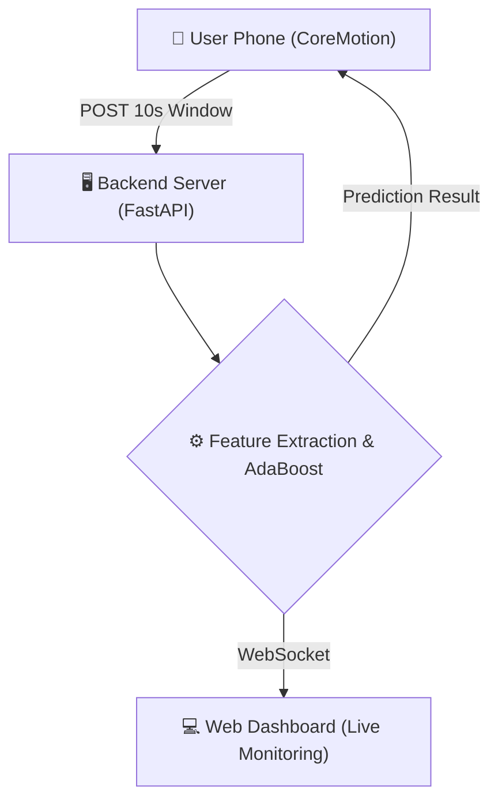

# Smartphone Placement Recognition

## Where is your phone? In your pocket? In your hand? In a bag?
What makes this unique is that it classifies the phone's location **using only two IMU sensors: the Accelerometer and the Gyroscope**. No GPS, no network signals, and no high-level APIs—just raw motion data.

---

## System Design

The live prediction framework streams data from the user's phone to the backend for real-time classification:



### Live System Dashboard
<div align="center">
   </br>
  
</div>

---

## Machine Learning Pipeline

1. **Preprocessing**: The raw 3-axis accelerometer and gyroscope data collected over 10-second windows is converted to m/s² and collapsed into orientation-invariant **L2 magnitude norms** to handle arbitrary phone orientations.
2. **Feature Extraction**: On-the-fly digital signal processing extracts 156 features (statistical, spectral/FFT, autocorrelation, Teager Energy Operator, multiscale entropy, and continuous wavelet transforms).
3. **Feature Selection**: Maximum Relevance Minimum Redundancy (MRMR) ranks the features, and a wrapper method determines the optimal subset. The final model uses only the **top 50 features**.
4. **Classification**: A **Decision-Tree Ensemble (AdaBoostM2)** classifier makes the final prediction.

---

## Accuracy (4-Class Classification)

For the 4-class configuration, pockets (front, back, and coat) are merged into a single **Pocket (P)** class, alongside **Lower-Back (LB)**, **Handheld (H)**, and **Shoulder Bag (SB)**.

### Model Accuracy vs. Feature Count
| Number of Features | Global Accuracy |
| :---: | :---: |
| 10 | 74.05% |
| 20 | 84.04% |
| 30 | 87.11% |
| 40 | 87.94% |
| **50 (Best Model)** | **88.52%** |
| 60 | 88.60% |
| 70 | 88.33% |
| 80 | 88.52% |
| 90 | 88.56% |
| 100 | 88.25% |
| 110 | 88.15% |
| 120 | 88.56% |
| 130 | 88.04% |
| 140 | 87.92% |
| 150 | 87.73% |
| 156 | 88.00% |

### Per-Class Performance (50 Features)
| Placement Class | Balanced Accuracy |
| --- | :---: |
| **Shoulder Bag (SB)** | 96.20% |
| **Lower-Back (LB)** (Phone is attached to lower back-- primarily for patient monitoring but could be thought of as backpocket lower-back is to be excluded from possibility which increases overall accuracy) | 94.57% |
| **Handheld (H)** (Phone is held in hand while walking, the hand is swinging)| 93.31% |
| **Pocket (P)** | 89.63% |

---

## How to Run the Live Prototype

### 1. Start the Backend Server
- Navigate to the `smartphone-placement-recognition` directory.
- Start the Python server:
  ```bash
  python server.py
  ```

### 2. Run the iOS App
- Open the `Where-My-Phone-at-prototype` project in **Xcode**.
- Update the server URL in `ContentView.swift` to match your computer's local IP address (e.g., `http://192.168.x.x:8000/predict`).
- Connect your **physical iPhone** (CoreMotion sensors are required, so simulators will not work).
- Run the app, tap "Start Continuous Prediction," and start walking!

### 3. Open the Web Dashboard (Optional)
- Open `dashboard.html` in your web browser to monitor predictions and confidence levels in real-time.
